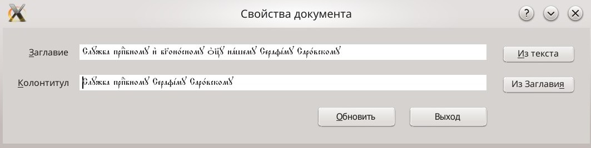
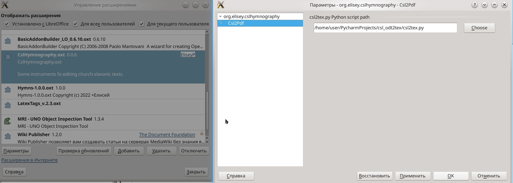

# HymnographyCSL
Some instruments fo editing church-slavonic texts.

Working on the ODT documents **with styles** from templates from [csl_odt2tex](https://github.com/EliseyP/csl_odt2tex) project.

**Setting Running Header dialog**

  with this dialog `Running Header` can be obtained from `Title` and set for the document.

**Creating and Styles operation**

 - create new csl document from template [Гимнография 20 новый.ott](https://github.com/EliseyP/csl_odt2tex/blob/main/%D0%93%D0%B8%D0%BC%D0%BD%D0%BE%D0%B3%D1%80%D0%B0%D1%84%D0%B8%D1%8F%2020%20%D0%BD%D0%BE%D0%B2%D1%8B%D0%B9.ott)

 - make black copy for red-colored csl document (in the same directory with `_BLACK.odt` suffix).

 - apply red-colored styles.

 - apply black-colored styles.

**csl2pdf**

 - dialog running.  

 - silent run (red-colored PDF).  

 - silent run (black-colored PDF).

### Setting Running Header dialog

Запуск `gui`-диалога, позволяющего оперировать текстом колонтитула для документа с шаблоном `Гимнография 20 новый` из проекта [csl_odt2tex](https://github.com/EliseyP/csl_odt2tex).

Для запуска диалога есть своя кнопка  на отдельной `toolbar`-панели, а также подменю в `Menu|Сервис|Addons`.

После запуска диалога в поле `Заглавие` автоматически помещается содержимое `user`-поля `TitleInText` (оно м.б. пустым, например, при создании документа).  
Также есть кнопка `Из текста`, для проведения этой операции **вручную**, при этом в поле помещается текст абзаца со стилем `Заглавие` (первый найденный).

У поля `Колонтитул` есть кнопка `Из Заглавия`, которая позволяет скопировать текст заглавия в поле колонтитула. Текст может редактироваться.

По нажатии кнопки `Обновить`, содержимое полей `Заглавие` и `Колонтитул` заносятся в `user`-поля `TitleInText` и `RunningHeader` соответственно. Содержимое поля `RunningHeader` при этом автоматически помещается в колонтитулы документа.

В данном примере укорочен текст Заглавия, слишком длинный для колонтитула.

### csl2pdf

Для работы расширения необходим скрипт `csl2tex.py` из проекта [csl_odt2tex](https://github.com/EliseyP/csl_odt2tex). 
Указать путь можно в **Параметрах** расширения. Меню `Сервис|Управление расширениями|CslHymnography.oxt`.  
**Note:** необходим весь каталог из этого проекта.

`Pdf`-файл (а также промежуточный `.tex` файл) сохраняется в том же каталоге, что и открытый документ. Имя файла, если не изменено в диалоге, совпадает с именем открытого `odt`-документа (без расширения).  
